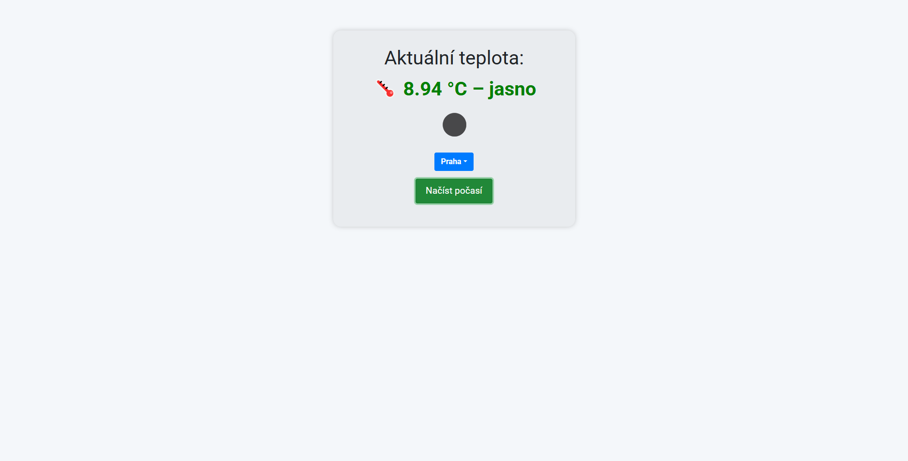

# 🌤️ Webová aplikace Počasí

Tato jednoduchá webová aplikace umožňuje zobrazit aktuální teplotu a popis počasí pro vybrané české město pomocí API [OpenWeatherMap](https://openweathermap.org/).

## 📸 Náhled

## ✨ Funkce

- Výběr města (Praha, Brno, Ostrava)
- Načtení aktuální teploty v °C
- Překlad popisu počasí do češtiny
- Barevné zvýraznění teploty:
  - Modrá: pod 5 °C
  - Zelená: 6–15 °C
  - Červená: nad 15 °C
- Ikona aktuálního počasí

## 🌐 Online verze

Aplikaci si můžeš vyzkoušet na adrese:  
➡️ [https://hanacektomas.github.io/weather_web](https://hanacektomas.github.io/weather_web)

## 🛠️ Technologie

- HTML, CSS, JavaScript
- [Bootstrap 4](https://getbootstrap.com/)
- GitHub Pages (hosting)
